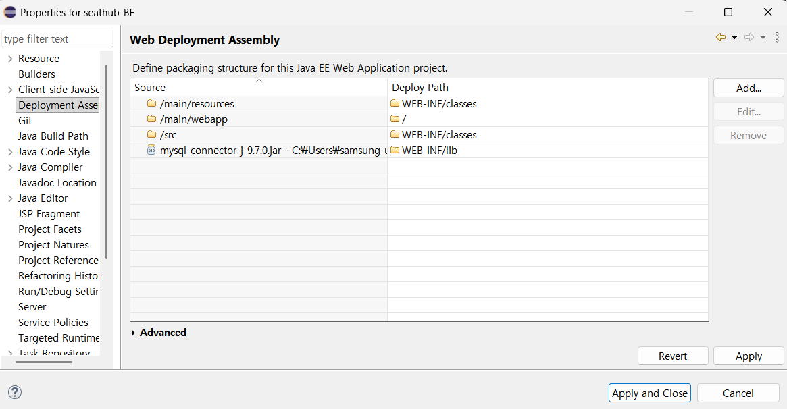

# Sazangnim-BE
DB 프로젝트 백엔드 레포지토리

## 프로젝트 개요
- DB 기반 스터디카페 예약 시스템 백엔드 레포지토리
- Eclipse + Tomcat + MySQL 환경에서 실행

---

## 변경 사항

- DBConnector.java 수정 → JDBC 드라이버 강제 로드
- main 폴더 생성 및 내부 폴더 구성
- config.properties 파일 위치 이동 → Tomcat이 클래스패스에서 설정 파일을 읽을 수 있도록 하기 위해
- seathub-BE 우클릭 → properties → **Deployment Assembly** 수정
     source                  Deploy path 
     src/main/resources      WEB-INF/classes
     src/main/webapp         /
     src                     WEB-INF/classes
     mysql-connector-j.jar   WEB-INF/lib
     
- seathub-BE 우클릭 → properties → **Java Build Path** 수정
  - `javax.servlet-api-4.0.1.jar` 추가
  - `mysql-connector-j-9.7.0.jar` 추가

## 확인 사항
- DB 초기화
  - `02_create_tables.sql` 실행 → 테이블 생성
  - `04_insert_sample_user.sql` 실행 → 샘플 데이터 삽입
- 테스트
  - 서버 실행 후 `http://localhost:8080/seathub-BE/api/mypage` 호출 → JSON 응답 확인

